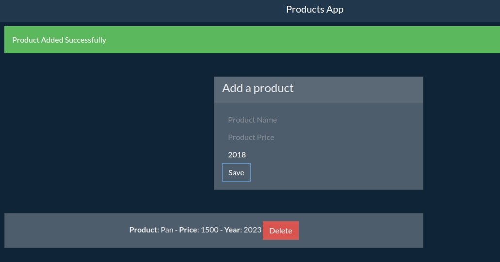

# AppProductsPOO

JavaScript project with object oriented programming that helps us to keep an inventory of products with price and date of completion. 

The intention of the project is to be able to delete the record when needed and not let add the record if the data is not completed.

App not running

Image showing what the product adds

Image showing product disposal

Image showing that the product cannot be added without missing data.

## Project functionalities

- Add products: When you click on save, you can add the product.
- See the alert of the added product `: To be able to visualize if the app has added the product with a confirmation.
- Do not let add product if data is missing `: Show with an alert that you can not add the product for lack of data.